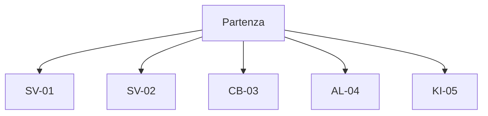

# Learning Paths

Questa pagina offre una panoramica dei percorsi guidati pensati per affrontare i macro-tipi di esercizi da **Spazi vettoriali** ad **Applicazioni lineari**.

> Ogni Path = obiettivo, input, laps operativi, grafico e "errori comuni".

!!! tip "Axio"
    Scegli il percorso che ti serve e affrontalo un lap alla volta!

## Menu dei percorsi

- [**SV-01 — Sottospazi, base e dimensione**](lp-sv-01.md): costruire sottospazi e determinare basi e dimensioni.
- [**SV-02 — Indipendenza, span e completamento a base**](lp-sv-02.md): valutare indipendenza e completare insiemi a base.
- [**CB-03 — Cambio di base: vettori e matrici**](lp-cb-03.md): passare tra basi diverse e rappresentare vettori e matrici.
- [**AL-04 — Definire T: linearità e matrice**](lp-al-04.md): definire applicazioni lineari e trovare la matrice associata.
- [**KI-05 — Ker, Im, Rank–Nullity, classificazione**](lp-ki-05.md): analizzare nucleo e immagine e classificare le applicazioni.

---

!!! info "Aggiornamenti"
    **Data:** 2025-08-13
    **Breve descrizione:** Aggiunta mappa dei percorsi e descrizioni sintetiche.
