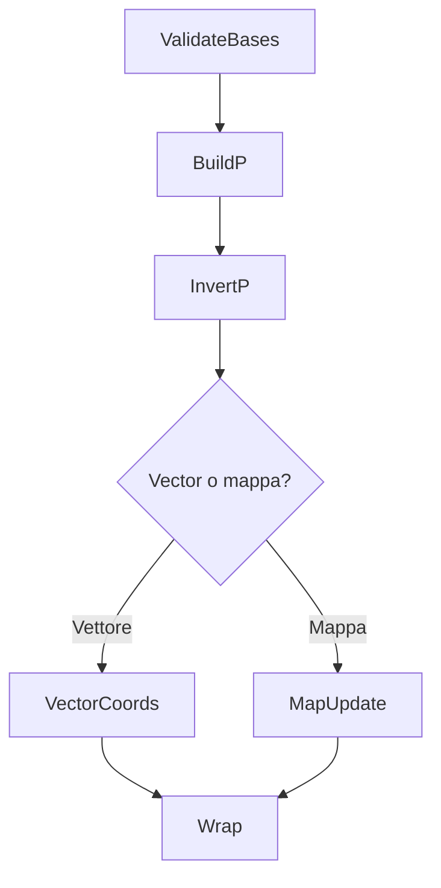

Impara a passare da una base all'altra costruendo le matrici di cambio base e aggiornando coordinate e rappresentazioni.

!!! tip "Axio"
    Controlla sempre il verso della freccia: stai passando da $B$ a $B'$ o viceversa?

**Lap**  
1) *ValidateBases*: verifica che $B$, $B'$ siano basi (indipendenti).  
2) *BuildP*: colonne = $\text{coord}_B(b_i')$.  
3) *InvertP*: ottieni $P^{-1}$.  
4) *VectorCoords*: $[v]_{B'} = P^{-1}[v]_B$.  
5) *MapUpdate*: $[T]_{B'} = P^{-1}[T]_B P$ (se $B'$ su dominio e codominio coincidenti).

Errori comuni: verso del cambio ($B\leftarrow B'$); dimenticare che le colonne di $P$ sono le coord di $B'$ **rispetto a** $B$.

---

!!! info "Aggiornamenti"
    **Data:** 2025-08-10
    **Breve descrizione:** Aggiunto percorso LP-CB-03.
