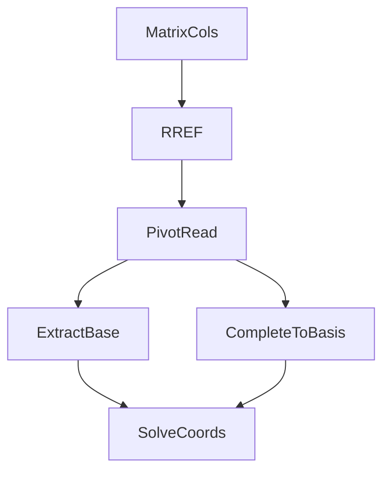

Scopri se un insieme di vettori è indipendente e come completarlo a base del vettore ambiente.

!!! tip "Axio"
    Se un vettore non è nei pivot, chiediti se puoi aggiungerlo per completare la tua base.

**Lap**  
1) *MatrixCols*: $M=[v_1\dots v_k]$.  
2) *RREF* → *PivotRead*: colonne pivot ⇒ indipendenti.  
3) *ExtractBase*: base(Span S) = colonne originali corrispondenti ai pivot.  
4) *CompleteToBasis*: se serve base(V), aggiungi vettori finché hai $n$ pivot.  
5) *SolveCoords*: risolvi $M c = v$ (se compatibile).

Errori comuni: usare colonne della RREF invece delle originali; chiedere coordinate se $v\notin \text{Span }S$.

---

!!! info "Aggiornamenti"
    **Data:** 2025-08-10
    **Breve descrizione:** Aggiunto percorso LP-SV-02.
